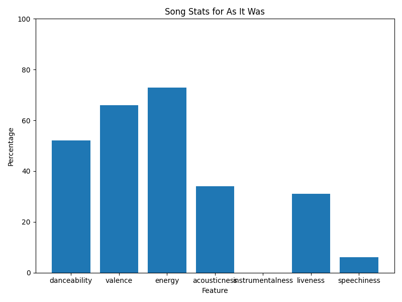
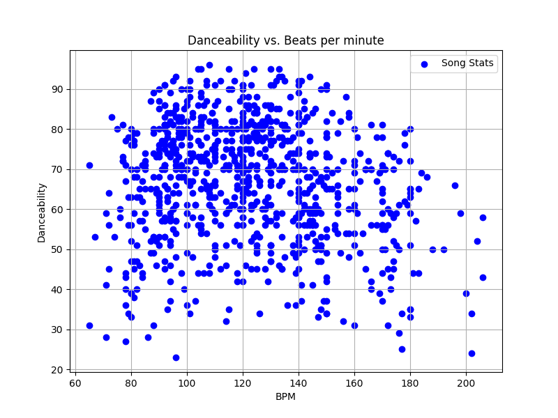

# Spotify Statistics Project

## Overview
This project is a terminal-based Python application that processes and visualizes Spotify song data from a CSV file. The application provides various statistical analyses and plots based on user-selected song features such as danceability, beats per minute (BPM), energy, and more. Users can also visualize song attributes for specific tracks and compare features such as danceability vs. BPM.

## Features
- **Data Analysis:** The program can calculate the highest, lowest, and average values for different song features (e.g., danceability, valence, energy, etc.).
- **Song Metadata Analysis:** Analyze metadata such as the release year of the oldest song, artist details, key, and mode.
- **Interactive Feature Selection:** Users can choose different song features to analyze through a menu-based interface.
- **Visualization:** Generates bar charts for song feature percentages and scatter plots for comparing attributes like danceability vs. BPM.
- **Custom Song Object:** Each row of the dataset is represented as a `Song` object, encapsulating song metadata and attributes.

## Prerequisites
Before running the program, ensure you have the following installed:
- Python 3.x
- NumPy (`pip install numpy`)
- Matplotlib (`pip install matplotlib`)

## CSV File
The program requires a CSV file named `spotify_data.csv` in the same directory as the script. The CSV file should contain the following columns:

| Column Name       | Description                            |
|-------------------|----------------------------------------|
| title             | Title of the song                      |
| artist(s)         | Artist(s) of the song                  |
| release           | Release date of the song               |
| num_of_streams    | Number of streams                      |
| bpm               | Beats per minute (BPM)                 |
| key               | Key of the song                        |
| mode              | Mode of the song (Major/Minor)         |
| danceability      | Danceability score (0 to 100)          |
| valence           | Valence score (0 to 100)               |
| energy            | Energy score (0 to 100)                |
| acousticness      | Acousticness score (0 to 100)          |
| instrumentalness  | Instrumentalness score (0 to 100)      |
| liveness          | Liveness score (0 to 100)              |
| speechiness       | Speechiness score (0 to 100)           |

Make sure this file is in the correct format for the program to run properly.

## How to Run
1. Clone or download this repository to your local machine.
2. Place the `spotify_data.csv` file in the same directory as the Python script (`spotify_program.py`).
3. Run the program from the terminal:
   ```bash
   python spotify_program.py
4. Follow the on-screen prompts to analyze various song features.

## Program Features
- **Song Feature Analysis:**
  - You will be prompted to choose a song feature (e.g., BPM, danceability) from a menu.
  - The program will calculate and display the highest, lowest, and average values for the selected feature.
  - If applicable, the title of the song with the highest feature value will also be displayed.

- **Song Metadata:**
  - The program can calculate the span of years between the oldest and newest songs and display the artist, key, and mode of the oldest song.

- **Visualization:**
  - **Song Stats Bar Chart:** After selecting a row (song), the program generates a bar chart displaying the percentage values of the song's attributes (e.g., danceability, valence, energy, etc.).
  - **Danceability vs. BPM Plot:** A scatter plot is created showing the relationship between danceability and BPM across all songs in the dataset.

## Example Output
- **Bar Chart:** Visualizes song attributes (danceability, energy, etc.) for a specific song.
- **Scatter Plot:** Compares danceability and BPM for all songs.

## Screenshots
1. **Bar Chart for Song Attributes:**
   

2. **Scatter Plot for Danceability vs. BPM:**
   

## Future Improvements
- Implement additional features such as filtering by genre or artist.
- Extend visualizations to include more complex song comparisons.

## License
This project is open-source and available under the [MIT License](LICENSE).
